# Median Oracle

This is a proof-of-concept smart contract that proposes a new type of price oracle. It is intended to perform the same function as Uniswap TWAP (Time-Weighted Average Price) oracles: digest the information resulting from trades on an AMM and allow for efficient querying of past prices in a way that mitigates the snapshot problem (for example manipulation with flash loans).

However, rather than using the arithmetic (Uniswap2) or geometric (Uniswap3) average of prices over a historical window, this oracle uses the median price within the window. If we wanted to shoe-horn it into the acronym schema, it could be called TWMP (Time-Weighted Median Price).

The following plot is from our simulation, using real Swap events from the Uniswap3 USDC/WETH 0.3% pool. The 30 minute median price tracks the 30 minute TWAP fairly closely. Both are lagging indicators that effectively smooth out the rough spikes caused by trading activity, although the TWAP glides over smooth curves whereas the median jumps between levels:

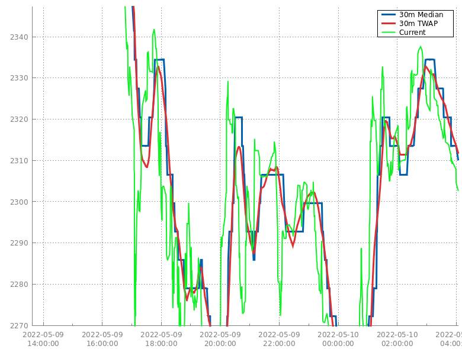

Here is a link to the contract code: FIXME. The remainder of this document consists of a description of the implementation and analysis of its behaviour.

## TWAP

Various attacks against Uniswap TWAPs have been [extensively analysed](https://github.com/euler-xyz/uni-v3-twap-manipulation/blob/master/cost-of-attack.pdf). In most cases TWAPs provide adequate security. However there are a few situations that remain problematic.

TWAPs are *not* vulnerable to "zero-block" attacks where an attacker manipulates a price but then moves it back in the same block. This is because 0 time passes within a block's execution, so the time-weight component is 0.

So called "one-block" attacks are when an attacker manipulates a price and then arbitrages it back in the next block to recover the funds at risk before anybody else has a chance to. This is possible (but risky) when using flashbots or selfish mining (where a miner tries to mine two blocks in a row but withholds the first one until the second is found). However, in order for a one-block attack to significantly modify the TWAP, the price must be moved to a very high (or very low) level, because it needs to outweigh all the other prices in the window. One of the advantages of geometric over arithmetic averaging is price movements are symmetric in the up and down directions.

"Multi-block" attacks are when an attacker manipulates a price and then attempts to hold it at this manipulated price for multiple blocks, either sacrificing funds to arbitrageurs or censoring transactions in some manner. These attacks are certainly harder and more risky, however they don't require moving the price as far as in a one-block attack since the manipulated price will have a larger time-weight.

In both of these cases, an averaged price will start to move immediately, and the speed at which it moves is related to how large the price manipulation is. As soon as the averaged price reaches a target level, an attack can begin by, for example, depositing price-inflated collateral into a lending protocol.

The exact attacker threat model for these attacks is still being determined. Certainly it includes attackers who can control or influence multiple blocks in a row. Miners have theoretically always had this ability, and systems like Flashbots have made it more accessible to everyone else.

Furthermore, with Ethereum's move to Proof of Stake, the mechanism of who creates blocks will change. Rather than being chosen effectively at random as with Proof of Work, validators will know ahead of time exactly when they will be able to create a block, and can choose to time an attack based on that. What's more, sometimes by chance validators (or colluding groups of validators) will be able to create multiple blocks in row. There are also potentially relevant changes coming to flashbots such as "MEV Boost" which could allow attackers to control entire block bodies and more.

All of this is to say that we think the time is now to being investigating alternate oracle designs that will improve security in the presence of price-manipulators who are also participants in blockchain consensus.

## Median Filtering

Median filtering is often used in image processing because it is very effective at removing [salt-and-pepper](https://medium.com/analytics-vidhya/remove-salt-and-pepper-noise-with-median-filtering-b739614fe9db) noise from images. This type of noise is caused by impulses, such as a cosmic ray, or a burned out camera pixel. By throwing out outlying pixels from the image and replacing them with their more reasonable-valued neighbours, images can be cleaned up with minimal distortion. Because the impulses are entirely thrown out, their presence has no impact on the output image. This is in contrast with other types of filters that incorporate the impulses in some kind of average.

For the same reason, our proposed price oracle uses median instead of mean as its foundation. Imagine that every second we pushed the current price onto a big array. To query a window of N seconds, we would take the last N prices, sort them, and return the middle (median) price. If the price has been stable for some period of time, this means that there is no value you can move the price to that will impact the median in the following block. What's more, even if you manipulate the price and are able to hold it at the manipulated level, you will need to sustain this manipulated price for N/2 seconds for it to have any impact whatsoever.

Of course, recording a price every second is impractical, so it makes more sense to think of each time interval as a stick, where the length corresponds to the amount of time the price was in effect. The sticks are sorted according to price (either ascending or descending, it doesn't matter) and arranged end-to-end in a big line. The stick that overlaps the mid-point of this big line provides the oracle's output price. In technical terms, this is called the "weighted median", where weight corresponds to stick length.

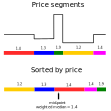

## Gas Usage Requirements

There are various implementation challenges with computing the median on-chain. First of all, the gas overhead to update the price oracle (ie during a swap) must be minimised so as not to penalise swappers just to maintain an oracle (which they likely don't care about). In this design, we have assumed that this operation must remain constant with respect to the number of observations mantained by the oracle, and should involve no more than 1 cold storage slot access (as with Uniswap3).

This rules out maintaining the set of observations in any kind of sorted data-structure. Therefore the weighted median must be entirely computed during oracle read time (when asking the oracle to provide a price). Here the requirements aren't quite as severe, but nevertheless for many applications it would be ideal if this overhead were kept as small as possible. For example, in lending markets like Compound/AAVE/Euler, a user's net assets and liabilities may need to be computed by a contract to determine if a requested action is permitted, and each of these may need an up-to-date price.

Although Uniswap3's oracle read gas usage is acceptable for many applications, systems that use centralised and non-objective oracles like Chainlink currently have a competitive advantage in this dimension. Ideally gas efficiency would match or exceed Chainlink's.

## Quantisation

Uniswap3 has a clever innovation that involves encoding prices into "ticks". These are essentially logarithms of the prices scaled and truncated in such a way that they can be efficiently stored. In Uniswap3's scheme, any tick can be represented by a number between -887272 and 887272 inclusive. This is 20.759 bits of information so it can be stored in an `int24` data-type which occupies only 3 bytes. Since there are many more possible prices than there are ticks, by the pigeonhole principle multiple prices can map to the same tick, and converting a price into a tick loses information.

This operation -- lossily compressing a large input domain down to a smaller output range -- is called quantisation. Our oracle design builds upon Uniswap3's tick concept (because it is our hope that in the future it could be adapted to work with... Uniswap4?), but adds another level of quantisation.

Given a tick value, we divide it by 30 and take the floor, giving a number between -29576 and 29575 inclusive. This is 15.8521 bits of information and can therefore pack into an `int16` (2 bytes). In order to recover an approximation of the original tick, we multiply by 30 and add 15. In signal processing jargon, this is called a mid-riser quantisation, since if you imagine the plot of inputs to outputs being a staircase, the 0 is right at the edge of a stair (the "riser"). In our case, an input tick of 0 will remap to a tick of 15, and a tick of -1 to -15.

Although packing a tick into 2 bytes has significant gas benefits (as we'll describe later), it reduces the precision of prices that can be tracked. While a Uniswap3 tick is always guaranteed to be no more than 0.005% away from the original price, our quantised ticks can be up to 0.15% away.

## Limitations

For reasons that will become clear in the following sections, our oracle has a few fundamental API limitations compared to Uniswap's TWAP:

* The minimum price resolution available is 0.3%, giving a maximum error of 0.15% (see the Quantisation section)
* The maximum time window that can be requested is 65535 seconds (about 18 hours 12 minutes)
* Only price can be queried, not pool liquidity

Additionally the proof of concept has a few implementation limitations that will be addressed in the future:

* The ring buffer is not resizable
* The storage of ring-buffer meta-data is not necessarily packed optimally, and will need to be integrated with the application contract

## Ring Buffer

### Updates

Like Uniswap3, our proposed oracle uses a ring buffer. Updates to the buffer work similarly, in that they will overwrite older values, meaning that once somebody has paid the gas to populate the entries, no storage writes will involve writing to a storage location containing 0 (which is particularly expensive).

Unlike Uniswap3, however, we attempt to pack multiple observations into a single slot. Each 32-byte slot is divided into 8 sub-slots of 4 bytes each. The first two bytes contain the quantised tick (see above) and the second two bytes contain the number of seconds since the previous update.

Because of how time is encoded, this means that an observation cannot be longer than 65535 seconds (a value of 0 seconds is invalid, and is reserved to indicate an uninitialised slot). This results in a limitation of the oracle, in that windows of longer than 65535 seconds (about 18 hours 12 minutes) cannot be queried. Price durations longer than 65535 seconds [saturate](https://en.wikipedia.org/wiki/Saturation_arithmetic) to 65535, which is fine since a window can never be longer than that.

One consequence of this encoding is that pre-populating the ring buffer ("increasing the cardinality" in Uniswap terms) requires 1/8th the gas cost compared to Uniswap3, per slot.

### Reads

Compared to Uniswap3, the oracle read mechanism is entirely different. After checking boundary conditions which involve loading both the first and last items in the ring buffer, the Uniswap3 oracle proceeds to binary search the ring buffer, starting with the middle element.

Our proposed oracle first checks if the time since the last update is older than the window. If so, it returns a cached copy of the current tick. Both of these values will be packed into a shared storage slot of the containing smart contract, so in this case no ring buffer access is needed whatsoever.

Otherwise, the oracle reads "backwards" (most recent observation first) in the ring buffer until it finds an observation older than or equal to the requested window. Because we keep a cached value of the current ring buffer entry on the stack, 8 elements are loaded with each storage load. Each element read is also pushed onto an array in memory. If adding the last element onto the array pushes the total observation time over the window length, it is artificially shortened. If there are not enough observations to satisfy the requested window, then the requested window parameter *itself* is shortened. This means that after loading from the ring buffer, the sum of the durations of all elements in the memory array is exactly equal to the (possibly modified) requested window.

At this point we have an unordered pile of sticks in our memory array. Our original description of weighted medium called for sorting them, however that would involve some unnecessary work. We just want to find the element that overlaps the middle of the total length of the stick: we don't care about the orderings of the sticks before or after that point.

There are various solutions to this problem, but our proof of concept uses the standard textbook solution (literally -- see exercise 9-2 in [CLRS Algorithms](https://www.amazon.com/Introduction-Algorithms-fourth-Thomas-Cormen/dp/026204630X/)). It implements a variation of QuickSelect, which is itself a variation of QuickSort. While QuickSort partitions its input into two segments and then recurses into each one, QuickSelect only recurses into the segment where the position of the element it is seeking resides (which it knows because it has determined the pivot index). This allows a position to be selected in O(N) time, rather than O(N log(N)) as with QuickSort. The variation required for weighted median simply chooses which direction to recurse based on the accumulated weights on one side (compared with half of the total weight), rather than an absolute position (which is unknown).

As always, there are a few minor tricks involved getting this to work efficiently on-chain:

* Solidity doesn't actually support dynamic memory arrays, so unfortunately to do this in one pass we need use a bit of assembly. This works by saving the free memory pointer ahead of time and then storing each element into unused space. At the end we increase the free memory pointer and store the original value (and length) into a memory array. Of course we need to ensure that no other memory allocations occur during the construction.
* Each element of the memory array is encoded specially. The observation's tick is converted into a non-negative integer by adding a large value to it, and then this value is cast to a `uint` and then shifted left, leaving lower order bits free to contain the duration of the observation. This way, sorting is possible by simply using the regular `>` and `<` operations on the `uint` datatype. Empirically, unlike storage, packing elements in memory beyond the word size is usually not worthwhile.

Once we have found the median element, it is simply a matter of converting it from its memory encoding, unquantising the internal tick, and returning the result.

Another difference between Uniswap3 and our proposed oracle is how requests for window lengths that cannot be satisfied (because the ring buffer is too short) are processed. While Uniswap3 fails with the error message `OLD`, we return the result for the longest available window, along with the size of that window. It is up to the calling code to decide if the resulting window is adequate.

# Simulation

In order to analyse our proposed oracle, we have constructed a simulation. We downloaded all the Uniswap3 `Swap` logs for various common pairs, and replayed them in a test environment. The test environment performs the implied pricing oracle updates against our oracle and a stripped down version of Uniswap3 which does nothing except for update the price oracle. This allows us to compare the current price to the median and TWAP, as well as examine gas usage between the two systems.

The following plots in this section are for some of the most popular Uniswap3 pools around the time of the Great Crypto Crash of May 12th, 2022. This period of time was chosen because there was an extreme amount of price activity and trading volume, which are the worst-case conditions for our oracle. Both Uniswap3 and the median oracle have their ring buffer sizes set to 144.

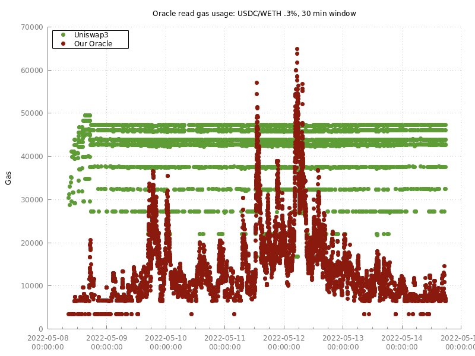
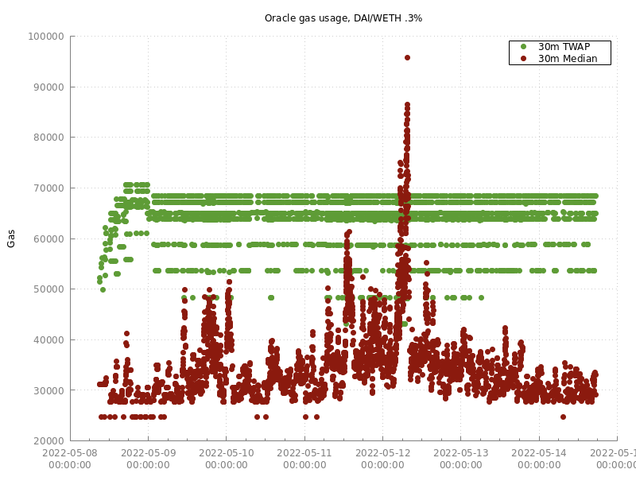
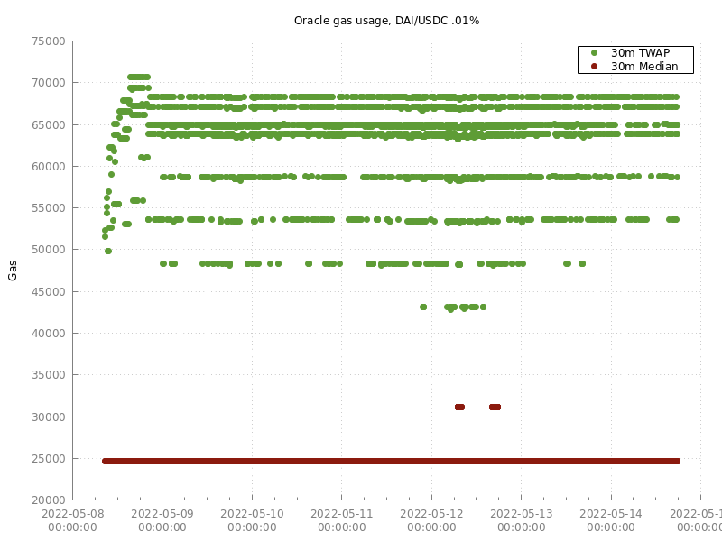
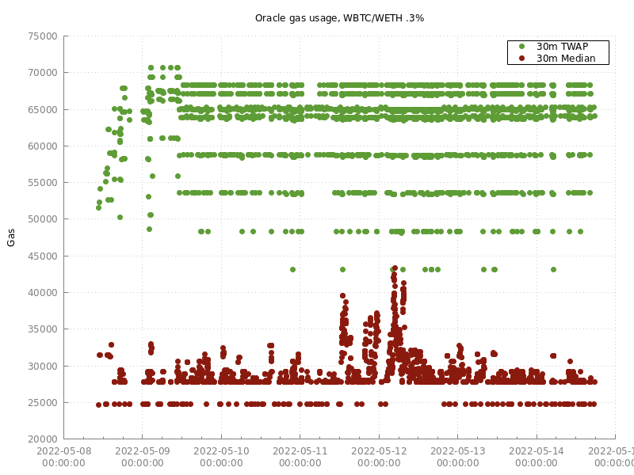
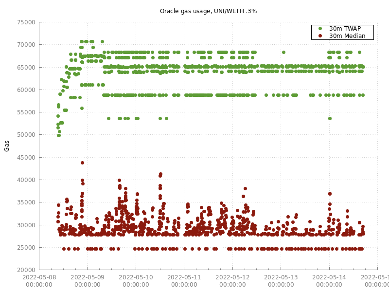
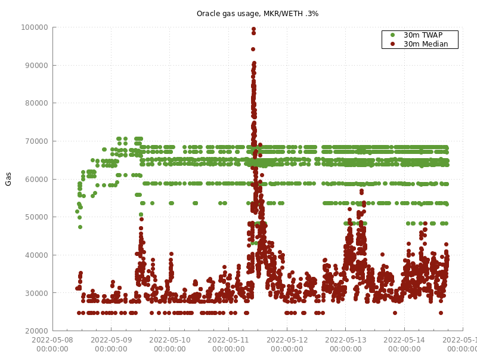
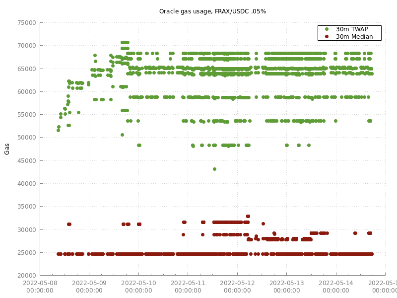

* The gas numbers include a 21000 gas overhead for creating a transaction (identical for median and Uniswap3). Typical overhead where the prices are queried from a smart contract would be smaller).
* The USDC/DAI pair illustrates the best-case scenario for the median price oracle. In this case, the price almost entirely remained within a  0.3% quantisation, so reads could be serviced with either 1 or 2 SLOADs.

# Window Sizing

One commonly cited advantage of centralised oracle systems like Chainlink is that they can respond to price movements faster than can TWAPs. This is true, but in practice isn't as much of an issue as is implied, for reasons outside the scope of this analysis.

As described above, the issue with TWAPs is they need to be a sufficient length in order to have many "good" samples out-compete the presumably few "bad" samples. However, with median oracles, "bad" samples, or to be more neutral, "outliers", do not have significant impact on the output price until their time-in-effect approaches half of the window size.

Because of this, we have reason to believe that median oracles can support shorter windows than TWAPs while maintaining equivalent security. If true, this would have two benefits:

* Legitimate price movements are reflected in the oracle output faster, leaving shorter windows of opportunity to attack protocols with stale prices
* Reducing the worst-case gas consumption of the oracle

To demonstrate the second point, we re-ran the USDC/WETH example above with a 10 minute window instead of a 30 minutes window. There was a significant improvement, and even at the peak of the crash the worst-case gas usage remained well below typical Uniswap3 costs: 

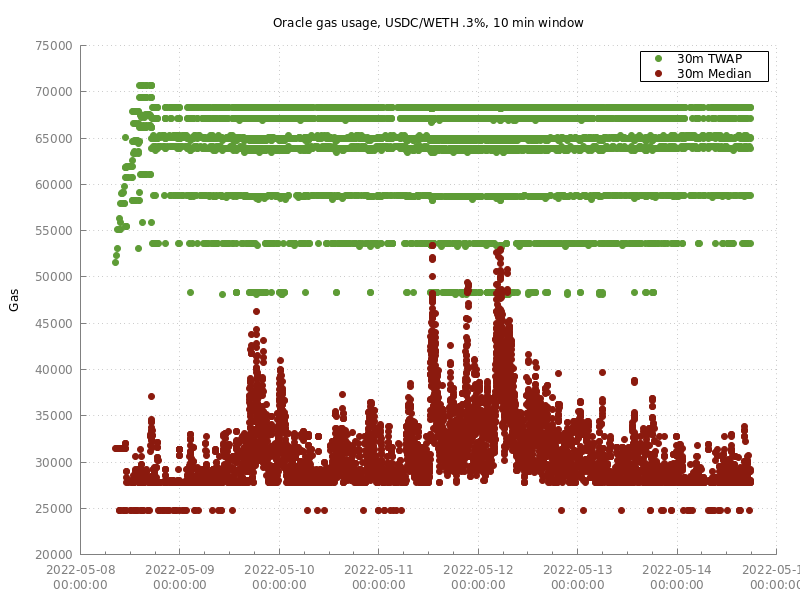

How much shorter the windows can be still needs to be researched. It will be especially important to create a detailed attacker threat model considering the changes resulting from Proof of Stake, MEV-Boost, etc.

# Other Notes

## Precision

The median oracle trades off price precision for gas efficiency. In real-world AMM usage, price movements are often relatively small. This may be due to small swaps or perhaps larger swaps that are arbitraged back in the same block to nearly the original price. With our oracle, price movements that don't change the quantised tick do not result in an oracle update. This reduces the work needed during read because there are fewer slots to scan (see the above simulation of USDC/DAI for a stark example of this). Note that Uniswap3 does this as well, but at 0.01% granularity instead of 0.3%. Most Chainlink oracles effectively have a price granularity of 1%.

The price error introduced by quantisation can be observed by zooming in on a section of our simulation's graphs where there are no trades for the duration of the window. In this case, both the TWAP and the median will settle down to a "steady state" which can be compared against the (unchanging) current price:

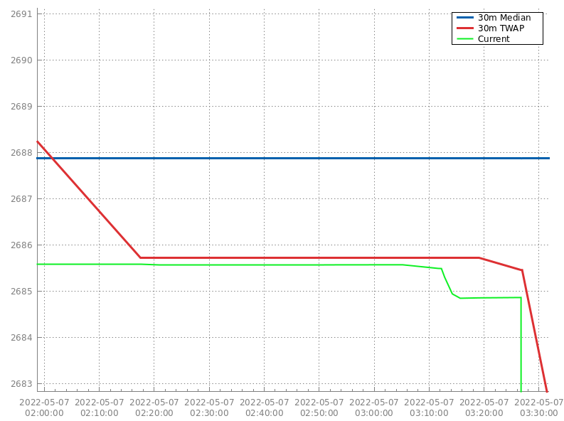

One possible worst-case trading pattern for our oracle would be a pool that oscillates across a tick boundary frequently. Even though the price movements would be small, each would involve a new entry added to the ring buffer. There are some ways to mitigate this though -- see the Future Optimisations section.

## Binary search overhead

The proposed median oracle has a clear gas advantage over Uniswap3 in almost all real-world market conditions that we have observed.

However, Uniswap3's oracle does have the advantage of a lower worst-case bound on gas usage. In addition its gas usage is more predictable, although another way to phrase that would be that it almost always exhibits worst-case behaviour. This is because its binary search algorithm performs `log2(N)` storage loads in most cases, where `N` is the size of the ring buffer.

It is an underappreciated fact that the larger the ring buffer grows in Uniswap3, the higher the gas costs for price reads will be. For example, here is the simulation of Uniswap3's oracle given two different ring buffer sizes: 144 and 1440 (the current cardinality for USDC/WETH .3% at the time of writing):

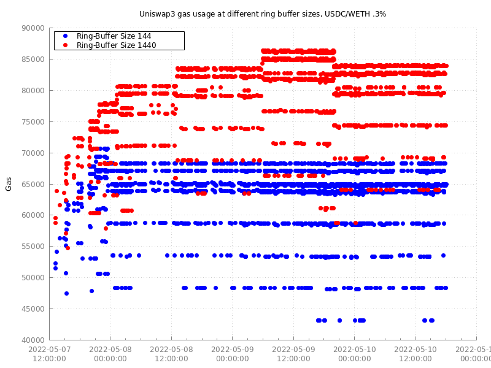

The initial data is skewed since the buffer is being populated. Once the horizontal bands start we are at the steady state. We haven't investigated this distribution in detail, but believe the bands have to do with how many iterations the binary search requires. By contrast, our proposed oracle is not affected at all by larger ring buffer sizes (assuming that the desired window is satisfiable).

## Accumulation of Quantisation Error

Quantisation error doesn't aggregate with median, does with mean FIXME: flesh out

# Future Optimisations

* In order to prevent the issue of prices oscillating around a quantised tick boundary and causing frequent appends to the ring buffer, a possible solution may be to look back one additional entry when applying a price update where the price has only moved one tick (and perhaps only if we're *not* on a storage slot boundary). If the previous entry is the same tick as the new tick, the most recent entry in the price oracle could be updated to account for the passed time, and then swapped with the previous entry. This would very slightly skew the calculated median, but probably would not be noticeable in practice.
* Our initial design had a "threshold" parameter that could be specified when reading the oracle. This would further quantise the data after reading from the ring buffer in order to coalesce nearby ticks together, further trading off price accuracy for gas efficiency. However, at this time we don't believe this strategy will be productive, since it only reduces the work required to compute the weighted median, which is generally dominated by the cost of reading the entries from storage. This might benefit from future study.
* If computing the weighted median cost more gas relative to SLOADing the entries, there are many possible optimisations. For example, small arrays could be processed with pre-computed "selection networks". Or, we could improve the pivot selection of the current algorithm. One very effective way to select pivots is with a pseudo-random number generator, since the "randomness" will compensate for any biases in the input data. An interesting approach would be for users of the price oracle to pass in a seed for the PRNG. They could simulate off-chain the gas usage for a series of seeds and select the best one to provide to the contract.

# Author

Doug Hoyte

(C) Euler XYZ Ltd.

The code is currently unlicensed, but will be released under an open source license in the near future.
